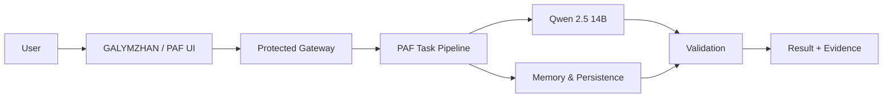

# PAF · AIKYN-LAB

**A sovereign agentic AI workflow built in Kazakhstan.**

PAF (Protocol for Agentic Flow) turns an AI response into a reproducible workflow: receive a task, structure it, execute with a local model, validate the result, persist it, and reopen it with proof of completion.

**Live public interface:** https://galymzhan.com

## HackAlem AI 2026

This repository is the public showcase for our HackAlem AI build. The production infrastructure remains private; this repo documents the product idea, architecture, demo contract, and verifiable working state.

## Demo contract

```text
Input task
   ↓
PAF task structure
   ↓
Qwen 2.5 14B
   ↓
Required-field validation
   ↓
Persist result
   ↓
Reopen result
   ↓
PASS / evidence
```

## What already works

- Self-hosted Qwen 2.5 14B inference.
- Protected web control plane.
- Structured task execution flow.
- Result persistence and repeatable reopening.
- Authenticated API boundary.
- Separate public UI and private runtime.
- Logging designed to avoid storing prompt text where it is not needed.

## Architecture



More detail: [docs/ARCHITECTURE.md](docs/ARCHITECTURE.md)

## What we are proving

The hackathon build is not about producing a single impressive chat answer. The goal is to demonstrate a **closed, inspectable execution loop**:

1. A human gives a task.
2. PAF creates a structured execution context.
3. A self-hosted LLM performs the language/reasoning step.
4. Required fields are checked.
5. The result is saved.
6. The same result can be reopened.
7. The system can show why the run is considered complete.

See [docs/DEMO.md](docs/DEMO.md).

## Privacy / security

This public repository intentionally contains **no credentials, private user data, internal IP addresses, production secrets, or private memory contents**.

The production environment is separated from this showcase repository.

## Project

Built by **AIKYN-LAB** in Kazakhstan.

Public project: **GALYMZHAN {AGI}**  
Website: https://galymzhan.com
